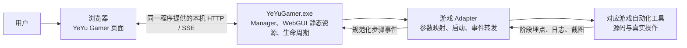
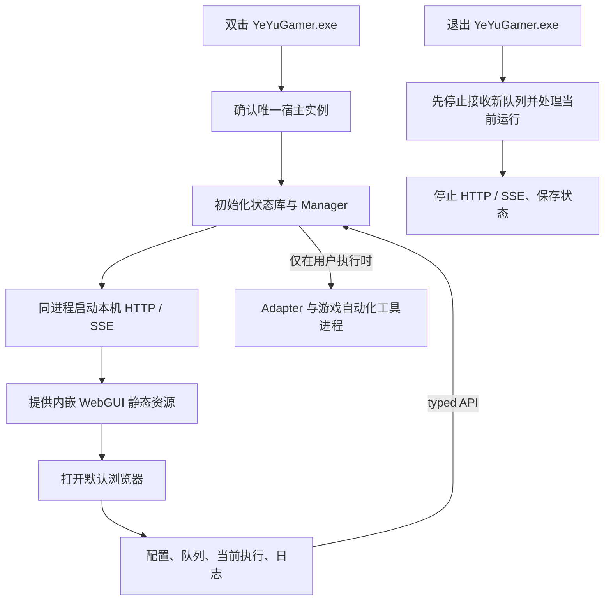
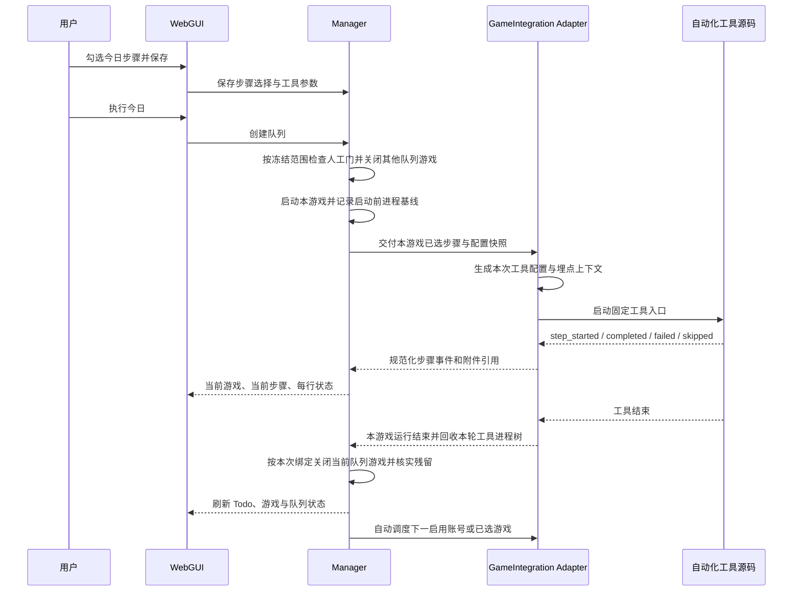

# YeYu Gamer：游戏自动化工具编排器

> 本文是产品架构的唯一设计入口。它描述目标职责，而不是声称某个游戏已经可运行或完成。历史发布审计、旧队列和旧游戏策略不能改变本文定义的产品边界。

## 产品定位

YeYu Gamer 是本机游戏自动化工具的**编排器**。它给用户一个统一面板：配置游戏和工具路径、选择今天要做的具体步骤、按队列启动对应工具、显示每一步进度与失败位置。

它不重新实现任何游戏的点击逻辑，也不替开源工具决定游戏内行为。外部程序如需调整配置，只调用 Manager 的普通 API；真正的执行链始终由 YeYu Gamer 本机完成。



## 程序生命周期：一个宿主 EXE，不是三个独立程序

YeYu Gamer 的发布形态对齐 Sunshine：**一个 `YeYuGamer.exe` 是唯一的桌面宿主**。它在同一进程内持有 Manager、HTTP API、已打包的 WebGUI 静态资源和 SQLite 状态；浏览器只是打开该宿主提供的本机页面，而不是另一套应用或另一条启动链。



这里的“一个 EXE”指用户可见且拥有生命周期的应用只有一个：

- `YeYuGamer.exe` 启动后自己提供 Web 页面；WebGUI 不单独启动，也不能在宿主未启动时显示旧快照或接受操作。
- 浏览器标签关闭不停止 YeYu Gamer；宿主退出才统一停止页面服务、事件流和本轮由它创建的 Adapter/工具进程树。
- 当前发布不依赖托盘。将来若保留托盘，也只能是 `YeYuGamer.exe` 内的界面线程，负责显示同一份状态和“打开页面／退出程序”；它不能再作为另一个 Manager 启动器或状态真源。
- 游戏自动化工具仍是被宿主在执行期间启动的子进程；它们不等于 YeYu Gamer 的第二个常驻程序。
- 更新、重启和单实例判断只针对这个宿主。Manager 的内部重载在宿主内完成，不再通过“托盘进程 → Manager host 进程”的接力来实现。

旧的 Python Tray → Manager host → 浏览器 链已归档为兼容/诊断入口，不再参与正常启动。正常安装、快捷方式与 `Start-YeYuGamer.ps1` 都只启动 `YeYuGamer.exe`；不得新增第二套状态或启动入口。

## 职责边界

| 模块 | 负责 | 不负责 |
| --- | --- | --- |
| WebGUI | 展示游戏卡片；编辑路径与每日配置；勾选今日步骤；显示当前步骤、历史结果和失败信息 | 判断工具内部怎样点击游戏；自己写运行状态 |
| Manager | 保存配置、今日选择、队列、运行和步骤状态；顺序调度游戏；向前端投影状态 | 解释某个游戏画面；实现各游戏的自动化 |
| 游戏 Adapter | 将统一配置转换为某工具配置；启动固定工具；把工具埋点转换为步骤事件 | 重新发明游戏每日逻辑；替工具猜测是否完成 |
| 上游自动化工具 | 游戏窗口操作、它自己的配置、它自己的任务流程、截图和错误 | 多游戏队列、统一页面、跨工具运行记录 |
**游戏内限制与风险判断属于对应游戏工具。** YeYu Gamer 只需要知道工具声明的步骤、可选参数、运行结果和错误。

## 两层配置：不要再混在一起

### 1. 今日步骤（用户勾选）

这是游戏卡片里的一排 Todo。每一行是用户今天希望运行的一个真实步骤，例如“进入主界面”“消耗体力”“领取邮件”。

- 每行可选或取消。
- 未选步骤绝不能由 Adapter 或工具顺手执行。
- 运行中每行只有 `pending`、`running`、`completed`、`failed`、`skipped` 五种面向用户的结果。
- `failed` 必须带当前工具的错误摘要以及可用的日志/截图引用；`skipped` 必须带工具实际给出的条件原因。

### 2. 工具参数（用户配置）

这是步骤的运行参数，不是 Todo。例如 OK-WW 的体力路线、无音区/锻造序号、模拟领域材料、是否补梦魇，以及附加任务。它们只影响被勾选步骤怎样执行。

这两层必须分别保存：`dailyTodoSelection` 保存选择，`dailyToolProfiles` 保存工具参数。前端不能把参数当成每日进度，Adapter 也不能把一次工具退出当成所有 Todo 的完成。

### 一键每日的队列契约

一键每日的范围等于：**开启游戏滑轨且至少选中一个每日步骤的游戏及其启用账号**。按游戏卡片顺序、同游戏内账号列表顺序依次执行；每个账号只收到用户选中的步骤。没有显式账号配置的游戏保留单个默认账号。

- 不做“可执行性预检”来剔除某个已选游戏，也不从后面的游戏中寻找替代者。
- 不存在“选了步骤就自动追加入口/必做步骤”的隐含选择。
- 勾选与参数在编辑时由 WebGUI 自动保存到 Manager；点击执行只读取已保存快照并创建批次，不会暗中改写开关或 Todo 选择。
- 某个游戏或步骤失败时，失败停留在对应行；默认策略继续后续已选游戏，只有用户显式选择“故障后停止”才结束队列。
- 每个游戏正常结束时，先回收本轮 Adapter/工具进程树。原生游戏的批次收尾使用本次安装绑定与 `close_for_queue` 关闭当前客户端，包括预先打开的最后一款；关闭期间继续检查人工接管、取消与批次归属。每次启动下一款游戏前，Manager 依据当前未封存执行批次的冻结游戏范围，通过同一关闭能力清理其中其他已配置客户端。独立 GameRun 与模拟器沿用各自的启动归属回收合同，不取得关闭其他游戏的权限。
- 队列清理只匹配已配置路径与登记进程名，身份无法确认的 PID 不会被强制关闭。存在未释放的人工现场时，保留客户端并暂停队列；路径绑定不明、关闭后仍有客户端或残留进程时，也阻止下一款游戏启动并明确记录人工处理原因。
- `human_required` 用于登录、验证码、条款等真实人工门，以及无法安全继续的队列清理门；此时保留工具与游戏现场并停止自动接管。

### 鸣潮账号身份与完成隔离

当前只开放鸣潮的显式多账号配置。Manager 的 `gameAccounts` 保存稳定 `accountId`、别名、启用状态与官方登录页已记住账号的精确掩码标签，以及各自的 `dailyTodoSelection` 和 `dailyToolProfiles.okWw`；顺序取自列表。标签是本机私有运行配置，不是密码，也不是账号所有权或当前登录身份的证明。账号缺少独立配置时从原共享配置初始化一次，之后由账号配置拥有选择和参数；显式空步骤列表表示本账号不执行。

- 每个游戏仍使用原有 `GameId` 与同一个 `GameIntegration`。批次冻结 `(gameId, accountId)` 目标与账号快照，不用变造 `GameId` 注册多个账号。
- 每个目标有独立 GameRun、RunAttempt、TodoInstance 和完成合同。Todo 的持久化唯一键是 `(account_id, todo_definition_id, period_key)`；旧默认账号维持原 Todo ID，迁移保留历史封存内容。
- Run 的账号快照在创建时冻结。任何执行 Run（包括排队中、尚未启动 Attempt 的 Run）都会锁住其账号登录标签；改用其他账号必须新增账号并停用旧项。纯计划不会锁定标签。
- Run、Todo、Attempt、证据与 CompletionReview/Adjudication 必须属于同一账号。旧默认账号的证据不能成为新账号的完成事实；续跑继承原 Run 与冻结账号范围。
- 鸣潮 Adapter 在每日步骤前，按冻结标签走官方已记住账号的选择流程。缺失或歧义标签、登录、验证码、条款等人工门会阻止进入每日并保留现场；账号选择结果不能替代逐 Todo 与奖励语义复核。
- 多个账号共用一个游戏客户端。运行与完成按账号隔离，进程关闭仍按冻结游戏范围和安装绑定执行；未释放的人工现场不能因为切换到另一个账号而被绕过。

当前实现仅完成相关离线合同与回归验证。真实鸣潮多账号每日、逐账号最终验收和全部目标游戏每日均仍待实机验证；项目仅供学习自动化编排。

## 每个游戏的接入物

每个游戏只有一个 `GameIntegration`，由 Adapter 拥有。它由以下四部分组成：

1. **步骤目录**：从工具源码/配置得到的真实步骤、显示名称、顺序和是否可选。
2. **参数映射**：YeYu Gamer 配置字段如何写入该工具的配置。
3. **启动器**：固定的工具入口与游戏路径使用方式。
4. **进度桥**：工具怎样声明 `started`、`completed`、`failed`、`skipped`，以及日志/截图如何关联到本次运行。

步骤目录不应由跨游戏的静态猜测清单维护。工具升级后，先更新对应 `GameIntegration`，再更新该游戏的卡片；不影响其他游戏。

## 运行主流程



运行时的唯一状态归属如下：

| 事实 | 唯一真源 |
| --- | --- |
| 游戏路径、工具路径、工具参数、勾选步骤 | Manager 配置 |
| 账号列表、启用顺序、记住账号的标签 | Manager 私有配置；执行时冻结到批次与 Run |
| 当前队列、当前游戏、每个 Todo 状态、失败摘要 | Manager 运行记录 |
| 自动化如何点击、如何识别画面、某步骤的内部子过程 | 对应游戏工具源码 |
| 工具阶段事件与原始日志/截图 | Adapter 转发的本次运行产物 |

## 埋点原则

埋点不是解析一段模糊文本后猜进度。对于可接入的工具，在源码的真实阶段边界写入结构化事件：

```text
step_started   当前 Todo 开始
step_completed 当前 Todo 成功返回
step_failed    当前 Todo 抛出或工具明确失败
step_skipped   当前 Todo 因源码条件不需要执行
```

事件必须带本次运行身份、步骤标识、时间、可读错误摘要，以及可选的日志/截图引用。Adapter 只转发和校验这些事件，Manager 只持久化和展示；两者都不重新推断游戏步骤。

如果上游工具把多个动作包在一个 `DailyTask` 中，不能假装它们已经是可独立选择的 Todo。要先在工具源码中为这些阶段加入选择与埋点，或将它们定义为一个不可拆分的步骤。**“界面能勾选”必须与“工具实际不会运行未勾选动作”一致。**

## 已登记接入的结论

鸣潮的 OK-WW 接入已采用本架构：`DailyTask` 的真实阶段成为可选 Todo，Adapter 向上游传递选择和配置，并把结构化阶段事件投影回同一行 Todo。旧目录里的“模拟领域贝币”“完成活跃”“领取 20/40/60/80/100”“复核奖励”不再作为鸣潮的每日步骤。

星穹铁道的 March7th runner 也只接受固定白名单操作，并对任务页相关步骤要求同轮视觉证据；它的入口、阶段和人工门见 [星铁接入规范](docs/integrations/starrail-march7th.md)。终末地与少女前线 2 已使用同一个 OpenKuro typed runner，但保留各自真实步骤与参数边界，不复用鸣潮的 Todo。

当前 promoted Adapter 在“所有已选 Todo 均完成且每项都有本轮 evidence”后仍进入语义复核，由 Manager 创建 Agent 复核工作项；工具阶段完成不直接产生 `accepted_done`。每项复核必须引用同一 TodoAttempt 的原始视觉证据并满足游戏专属条件。自动机器复核是尚未完成的接入目标，需要上游提供可验证的逐操作语义证明；现有日志文字、退出码或非黑屏截图不能替代它。缺证据、工具报错、视觉专属条件不满足或真实人工门继续按完成合同停住。

鸣潮的完整阶段目录、参数字段、页面布局、事件语义和升级规则见 [OK-WW 接入规范](docs/integrations/ok-ww.md)。其余游戏必须按同样的“选择隔离 + 阶段事件 + 证据”结构接入，而不是复用鸣潮的步骤名称或工具参数。

## 文档层级

| 文档 | 作用 |
| --- | --- |
| `ARCHITECTURE.md` | 产品职责、数据归属、接入方式与主流程；以本文为准 |
| `README.md` | 安装、启动与本地使用入口；不再承载游戏策略 |
| `backend/README.md` | Manager API 与数据模型 |
| `adapter-host/README.md` | Adapter 协议与各游戏接入要求 |
| `webgui/README.md` | 页面、配置编辑与状态展示 |
| `docs/integrations/ok-ww.md` | 鸣潮 OK-WW 的具体接入契约；不外推为其他游戏规则 |
| `docs/integrations/starrail-march7th.md` | 星穹铁道 March7th Assistant 的具体接入契约 |

## 运行诊断：日志、证据与留存

Manager 是唯一的诊断真源，每一次运行都要能在事后被完整回放：

- **文件日志**：`runtime\logs\manager\manager.log`（按天轮转，默认保留 14 天，`YEYU_GAMER_LOG_RETENTION_DAYS` 可调；`YEYU_GAMER_LOG_LEVEL=DEBUG` 提高粒度）。每条记录带 `batch/run/attempt/game/todo/phase` 关联字段，与 SQLite 事件账本使用同一组 ID。uvicorn 的启停记录并入同一文件；宿主 EXE 不再依赖 stdout 重定向。
- **每次 RunAttempt 一个目录**：`runtime\logs\runs\<日期>\<GameId>-<runAttemptId>\`，内含 `attempt.log`（该 attempt 的全部 Manager 记录：准备、启动器阶段、逐 Todo 事件、清理、结果分类）、`adapter.stdout.jsonl`（Adapter Host 原始事件流全量）与 `adapter.stderr.log`。
- **启动器阶段证据**：游戏客户端出现稳定窗口之前，Manager 每 60 秒对自己启动的启动器/客户端窗口截一帧（`game-ui-launch-phase`），驾驭已审计按钮后、窗口就绪时（`game-ui-launch-ready`）与任何 `GameLaunchError` 前（`game-ui-launch-failed`）各留一帧，并写入 `game-launch.phase` 事件；官方启动器在下载/更新时按进程磁盘写入量识别为“更新中”，此时不计 no-effect、不触发盲点兜底，等待上限为 3 小时。
- **Todo 边界截图失败不再静默**：`todo-step-capture.failed` 事件与日志记录原因。
- **队列清理与进程残留**：Manager 将冻结范围、目标游戏、路径/PID 身份核验、关闭结果和残留情况记录在 `game-launch.queue-cleanup` 事件及本次 attempt 的 `queueGameCleanup` 中；既有残留扫描另有 `manager.zombie-reap` / `game-launch.zombie-detected` 事件。正常关闭优先请求客户端退出，后续有界回收仍须满足精确身份与取消边界。未释放的人工现场必须保留，身份不明的 PID 不强杀，残留或清理不完整会阻止下一款游戏启动。进程仍被列出并不能单独证明驱动故障或只能重启恢复；清理前后的内存数值只记录观测差异，不据此声称清理产生了确定的内存收益或解释残留成因。
- **账本留存**：批次事件只携带精简 result 投影；14 天以外的非保护事件、幂等键和已结束命令回执按周期清理，碎片超过 64 MB 且没有活动批次时执行 `VACUUM`。快照投影只读取最近 8 天的运行与批次。
- **单实例**：任何入口在运行 ASGI lifespan（含状态恢复）之前必须先独占绑定 8877 端口；端口被占用直接以退出码 3 结束，不触碰共享 SQLite。CLI `open-webgui` 在 Manager 健康时只打开浏览器。

## 明确不做

- 不把 YeYu Gamer 变成外部运行时或游戏策略中心。
- 不在 YeYu Gamer 复制每个工具的图像识别、坐标、行为树或游戏规则。
- 不将“工具退出”“页面勾选”或“队列创建”误写为步骤完成。
- 不用跨游戏的泛化 Todo 猜测上游工具的实际每日。
